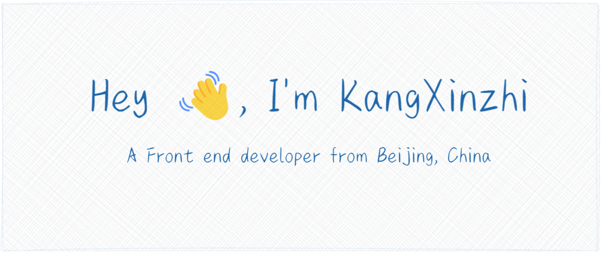

----

<h2>🚀 Languages and Tools:</h2>
<code></code>
<code></code>
<code></code>
<code></code>
<code></code>
<code></code>
<code></code>

|  |  |
| ------------------------------------------------------------------------------------------------------------------------------------------------------------ | --------------------------------------------------------------------------------------------------------------------------------------------------------- |
